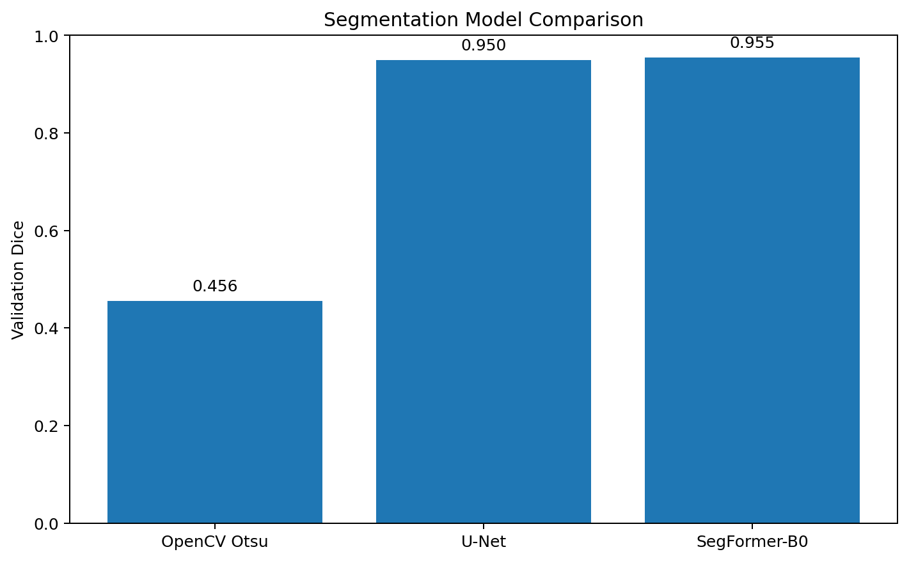
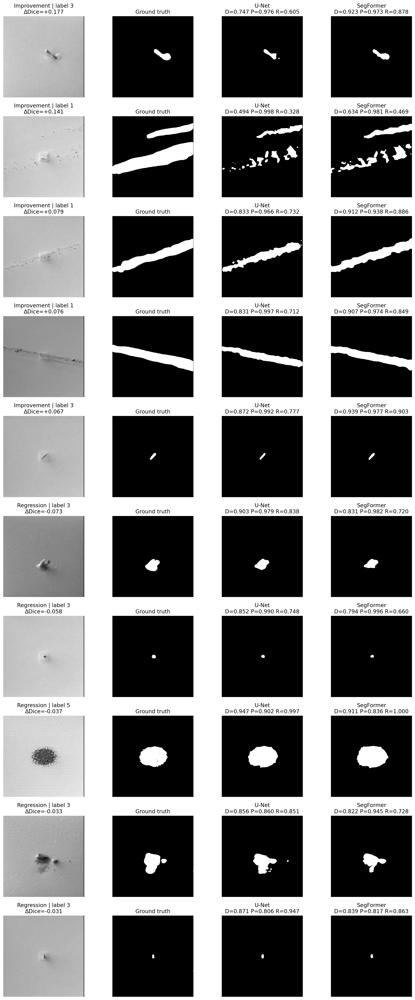
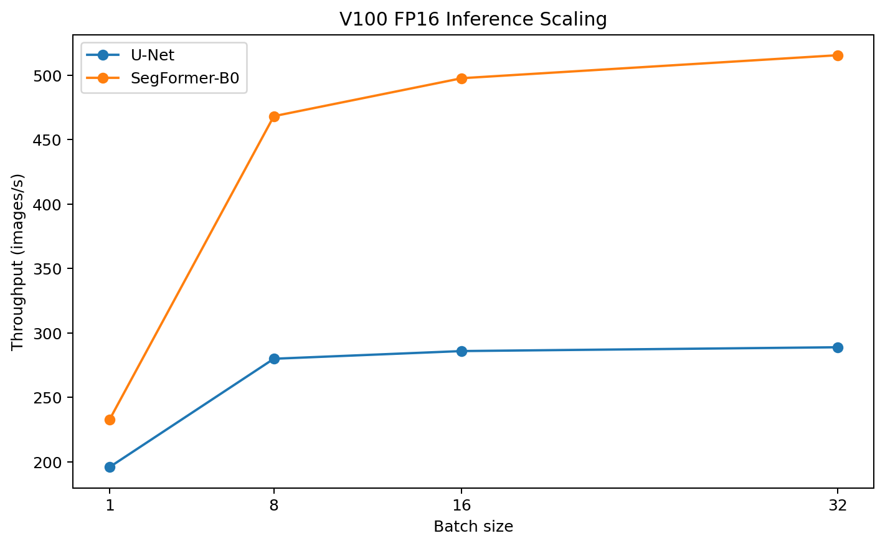

# Semiconductor Defect Vision System

End-to-end computer vision and ML engineering system for pixel-level semiconductor defect inspection using scanning electron microscope (SEM) imagery.

The project compares classical image processing, CNN-based semantic segmentation, and transformer-based segmentation; performs controlled validation and error analysis; packages the selected model behind a reusable inference interface and CLI; and benchmarks GPU inference on an NVIDIA Tesla V100.

## Highlights

* 4,591 real grayscale semiconductor SEM images from the Carinthia-S dataset
* Leakage-aware frozen train / validation / test split
* Classical OpenCV segmentation baseline
* Custom U-Net segmentation model
* SegFormer-B0 transformer segmentation model
* Per-image, per-class, defect-size, and qualitative error analysis
* Validation-only probability-threshold analysis
* FP32 vs FP16 numerical validation
* GPU latency, throughput, batch-scaling, and VRAM benchmarking
* Production-style inference module and CLI
* Self-contained offline SegFormer deployment
* NVIDIA GPU Docker deployment
* Final evaluation performed once on the previously untouched test split

## Final Result

The selected deployment configuration is:

| Component                          | Selection                      |
| ---------------------------------- | ------------------------------ |
| Model                              | SegFormer-B0                   |
| Input                              | 480 × 480 grayscale SEM        |
| Precision                          | FP16 automatic mixed precision |
| Threshold                          | 0.50                           |
| Validation Dice                    | 0.9550                         |
| Final test Dice                    | **0.9571**                     |
| Final test IoU                     | **0.9251**                     |
| Parameters                         | 3.71M                          |
| Single-image end-to-end latency    | **6.29 ms**                    |
| Single-image end-to-end throughput | **158.9 images/s**             |

The final model was selected using the validation split. Architecture, checkpoint, probability threshold, preprocessing, and numerical precision were frozen before the test set was evaluated.

---

## Model Comparison

| Model                | Validation Dice | Validation IoU | Parameters |
| -------------------- | --------------: | -------------: | ---------: |
| OpenCV Otsu baseline |          0.4556 |         0.3232 |          — |
| U-Net                |          0.9498 |         0.9149 |      7.76M |
| **SegFormer-B0**     |      **0.9550** |     **0.9241** |  **3.71M** |

Deep learning produced the major performance gain over the classical intensity-based baseline. SegFormer provided a smaller but consistent improvement over U-Net while using fewer parameters.

Across the 437 nonempty validation images, SegFormer produced higher Dice than U-Net on 310 samples and lower Dice on 127.



## Final Test Performance

The frozen SegFormer-B0 deployment configuration was evaluated once on the 459-image test split.

| Metric              |  Test Result |
| ------------------- | -----------: |
| Mean Dice           | **0.957080** |
| Mean IoU            | **0.925138** |
| Nonempty mean Dice  | **0.954919** |
| Empty-mask accuracy | **1.000000** |

### Test Dice by class

| Class | Samples | Mean Dice |
| ----- | ------: | --------: |
| 1     |       6 |    0.8414 |
| 2     |       1 |    0.8312 |
| 3     |     400 |    0.9560 |
| 4     |      29 |    0.9687 |
| 5     |       1 |    0.9293 |
| 6     |      22 |    1.0000 |

Classes 2 and 5 contain only one test sample each, so their individual values should not be interpreted as reliable estimates of class-wide performance.

---

## U-Net vs SegFormer Error Analysis



The aggregate improvement from SegFormer was supported by per-image and qualitative analysis.

Several patterns emerged:

* SegFormer frequently improved recall while maintaining similar precision.
* On some class-3 defects, U-Net captured only part of the visible defect while SegFormer covered more of the annotated region.
* On clustered class-1 defects, U-Net often tightly outlined individual structures while SegFormer produced broader or connected regions that more closely matched the broader ground-truth annotation.
* Some differences therefore reflect agreement with annotation morphology rather than an unambiguous difference in ideal visual boundary placement.
* Remaining low-Dice cases include both under-segmentation and over-segmentation rather than one universal failure mode.

SegFormer also achieved higher mean Dice in every target-mask area quartile:

| Validation target-area group | U-Net Dice | SegFormer Dice |
| ---------------------------- | ---------: | -------------: |
| Smallest 25%                 |     0.9104 |     **0.9157** |
| 25–50%                       |     0.9578 |     **0.9654** |
| 50–75%                       |     0.9556 |     **0.9589** |
| Largest 25%                  |     0.9656 |     **0.9713** |

---

## Probability Threshold Analysis

Both models were initially evaluated with a probability threshold of 0.50.

A validation-only sweep from 0.10 to 0.90 showed:

| Model        | Threshold 0.50 | Best tested | Best Dice | Improvement |
| ------------ | -------------: | ----------: | --------: | ----------: |
| U-Net        |       0.949786 |        0.20 |  0.950336 |   +0.000550 |
| SegFormer-B0 |       0.955009 |        0.45 |  0.955049 |   +0.000040 |

The improvements were negligible, so the common threshold of **0.50** was retained rather than over-optimizing to the validation set.

---

## Mixed Precision

FP16 automatic mixed precision was validated numerically before being selected for deployment.

| Model        | FP32 Dice | FP16 Dice | Binary prediction disagreement |
| ------------ | --------: | --------: | -----------------------------: |
| U-Net        |  0.949786 |  0.949794 |                      0.000161% |
| SegFormer-B0 |  0.955009 |  0.955007 |                      0.000191% |

The segmentation outputs were effectively unchanged, while FP16 substantially improved inference performance on the V100.

---

## V100 GPU Benchmark

Benchmarks used 480 × 480 inputs and included the model forward pass, sigmoid, and binary thresholding.

Hardware during the final benchmark series:

* NVIDIA Tesla V100-SXM2-32GB
* 150 W power limit
* CUDA-enabled PyTorch 2.14.0+cu126
* PCIe Gen3 x8 negotiated link during the reported final benchmark session

### GPU-resident inference

| Model         | Precision |  Batch | Latency / batch |    Throughput |
| ------------- | --------- | -----: | --------------: | ------------: |
| U-Net         | FP32      |      1 |         8.30 ms |     120 img/s |
| U-Net         | FP16      |      1 |         5.11 ms |     196 img/s |
| SegFormer     | FP32      |      1 |         5.37 ms |     186 img/s |
| **SegFormer** | **FP16**  |  **1** |     **4.30 ms** | **233 img/s** |
| U-Net         | FP32      |     32 |       203.90 ms |     157 img/s |
| U-Net         | FP16      |     32 |       110.77 ms |     289 img/s |
| SegFormer     | FP32      |     32 |       113.99 ms |     281 img/s |
| **SegFormer** | **FP16**  | **32** |    **62.07 ms** | **516 img/s** |

At batch size 32, FP16 increased throughput by approximately 1.84× for both architectures.



### End-to-end single-image inference

This measurement uses the production inference interface and includes:

1. JPEG read and decode
2. grayscale conversion
3. NumPy/tensor preparation
4. model-specific normalization
5. host-to-device transfer
6. model inference
7. sigmoid and threshold
8. device-to-host probability transfer
9. returned binary mask

| Model         | Precision | Mean latency | P95 latency |      Throughput |
| ------------- | --------- | -----------: | ----------: | --------------: |
| U-Net         | FP32      |     10.20 ms |    11.04 ms |      98.0 img/s |
| U-Net         | FP16      |      6.67 ms |     6.96 ms |     149.9 img/s |
| SegFormer     | FP32      |      6.64 ms |     7.31 ms |     150.7 img/s |
| **SegFormer** | **FP16**  |  **6.29 ms** | **7.17 ms** | **158.9 img/s** |

These are warm-cache workstation measurements and should not be interpreted as raw storage-I/O benchmarks.

---

## Dataset

The project uses **Carinthia-S**, a public semiconductor defect dataset containing:

* 4,591 grayscale SEM images
* six defect classes
* 480 × 480 images in the released dataset used here
* expert-validated segmentation masks
* severe class imbalance

Official dataset:

https://zenodo.org/records/16895427

Class distribution:

| Class | Samples |
| ----- | ------: |
| 1     |      55 |
| 2     |       8 |
| 3     |   4,008 |
| 4     |     289 |
| 5     |       4 |
| 6     |     227 |

Because of the extreme imbalance, raw accuracy is not used as the primary evaluation metric.

### Data validation

The ingestion pipeline verifies:

* image/mask pairing
* dimensions
* image readability
* mask modes
* mask intensity values
* empty/nonempty masks
* defect area
* connected-component count
* bounding boxes

Raw masks are preserved unchanged.

For canonical model training/evaluation, masks are converted to grayscale and thresholded at `>=128`.

### Leakage audit

Exact decoded-image hashing found no exact duplicates.

A near-duplicate audit identified one convincing two-image group. The pair was explicitly kept within the same training split to prevent leakage.

---

## Frozen Dataset Split

The final leakage-aware split contains:

| Class     |     Train | Validation |    Test |
| --------- | --------: | ---------: | ------: |
| 1         |        44 |          5 |       6 |
| 2         |         6 |          1 |       1 |
| 3         |     3,207 |        401 |     400 |
| 4         |       231 |         29 |      29 |
| 5         |         2 |          1 |       1 |
| 6         |       183 |         22 |      22 |
| **Total** | **3,673** |    **459** | **459** |

The test split remained untouched until model selection, threshold analysis, mixed-precision validation, qualitative analysis, and deployment configuration were complete.

---

## Classical Computer Vision Baselines

Two OpenCV-based segmentation pipelines were evaluated before neural models.

### Otsu thresholding

Best validation configuration:

* Gaussian blur: 3
* inverted threshold
* 5 × 5 morphological opening

Validation mean Dice:

**0.4556**

### Adaptive thresholding

Best validation mean Dice:

**0.4078**

Classical threshold-based methods were useful for high-contrast structures but produced substantial failures from texture, illumination variation, and SEM background patterns.

This establishes a meaningful non-neural baseline for quantifying the improvement from learned segmentation.

---

## Models

### U-Net

Custom compact four-level U-Net:

* 7.76M parameters
* BCE + Dice loss
* horizontal / vertical flip augmentation
* AdamW
* validation-selected checkpoint
* validation Dice: **0.9498**

### SegFormer-B0

Transformer-based semantic segmentation model:

* MiT-B0 encoder initialization
* 3.71M parameters
* grayscale replicated to three channels
* ImageNet normalization
* BCE + Dice loss
* horizontal / vertical flip augmentation
* validation-selected checkpoint from epoch 19
* validation Dice: **0.9550**
* final test Dice: **0.9571**

---

## Production Inference

The reusable inference interface is implemented in:

```text
src/inference/segmentation_predictor.py
```

It supports:

* U-Net or SegFormer
* CPU or CUDA
* FP32 inference
* FP16 CUDA inference
* configurable probability threshold
* image-path and NumPy-array input
* probability-map output
* binary-mask output

The SegFormer production path constructs the architecture using a local JSON configuration and loads the trained local checkpoint.

Runtime inference does **not** require Hugging Face Hub access.

---

## CLI Inference

Default deployment:

```bash
python -m scripts.predict_segmentation \
  path/to/sem_image.jpg \
  --output-mask predicted_mask.png
```

On a CUDA system, the CLI defaults to:

```text
model      = SegFormer
precision  = FP16
threshold  = 0.50
device     = CUDA
```

Optional probability-map output:

```bash
python -m scripts.predict_segmentation \
  path/to/sem_image.jpg \
  --output-mask predicted_mask.png \
  --output-probability probability.npy
```

Force U-Net:

```bash
python -m scripts.predict_segmentation \
  path/to/sem_image.jpg \
  --model unet \
  --precision fp32
```

---

## Docker GPU Inference

Build:

```bash
docker build \
  -t semiconductor-defect-vision:0.1.0 \
  .
```

The trained checkpoint is intentionally mounted at runtime rather than embedded in the container image.

Example:

```bash
docker run --rm \
  --gpus all \
  --user "$(id -u):$(id -g)" \
  -v "$PWD/models/segformer_b0_best.pt:/app/models/segformer_b0_best.pt:ro" \
  -v "$PWD/data/raw/carinthia-s/data/images:/input:ro" \
  -v "$PWD/output:/output" \
  semiconductor-defect-vision:0.1.0 \
  /input/example.jpg \
  --output-mask /output/predicted_mask.png
```

Docker GPU inference was verified on the V100 with:

* PyTorch 2.14.0+cu126
* CUDA available inside the container
* V100 compute capability 7.0
* Hugging Face offline mode enabled

A known validation sample produced exactly the same **22,809 foreground pixels** through:

1. the host production predictor,
2. the host CLI, and
3. the Docker GPU CLI.

---

## Environment

Primary development environment:

* Ubuntu 22.04
* Python 3.10
* PyTorch 2.14.0+cu126
* torchvision 0.29.0+cu126
* Transformers 5.17.0
* CUDA-enabled NVIDIA Tesla V100

Create an environment:

```bash
python3.10 -m venv .venv
source .venv/bin/activate
```

Install the CUDA 12.6 PyTorch build:

```bash
python -m pip install \
  torch==2.14.0+cu126 \
  torchvision==0.29.0+cu126 \
  --index-url https://download.pytorch.org/whl/cu126
```

The exact development environment used for the experiments is recorded in:

```text
requirements-lock.txt
```

Minimal inference dependencies are listed in:

```text
requirements-runtime.txt
```

---

## Reproducing the Pipeline

Typical workflow:

```bash
python -m scripts.build_manifest
python -m scripts.run_eda
python -m scripts.audit_duplicates
python -m scripts.build_splits
python -m scripts.compute_training_statistics
```

Classical baselines:

```bash
python -m scripts.evaluate_threshold_baseline
python -m scripts.evaluate_adaptive_threshold_baseline
```

Train learned models:

```bash
python -m scripts.train_unet_baseline
python -m scripts.train_segformer_baseline
```

Validation evaluation:

```bash
python -m scripts.evaluate_unet_validation
python -m scripts.evaluate_segformer_validation
python -m scripts.compare_segmentation_models_validation
python -m scripts.analyze_segmentation_by_defect_size
python -m scripts.sweep_segmentation_thresholds
python -m scripts.evaluate_mixed_precision_validation
```

GPU benchmarking:

```bash
python -m scripts.benchmark_segmentation_gpu
python -m scripts.benchmark_segmentation_end_to_end
```

Final test evaluation:

```bash
python -m scripts.evaluate_final_test
```

The final test command should be treated as a reporting step, not a hyperparameter-tuning loop.

---

## Testing

Run:

```bash
pytest -q
```

Static checks:

```bash
ruff check .
```

The test suite covers data processing, transformations, segmentation behavior, inference preprocessing, and CLI behavior.

---

## Repository Structure

```text
semiconductor-defect-vision/
├── configs/
├── data/
│   ├── raw/
│   └── processed/
├── docs/
├── models/
├── reports/
│   ├── benchmark/
│   ├── figures/
│   ├── test/
│   └── training/
├── scripts/
├── src/
│   ├── classical_cv/
│   ├── data/
│   ├── evaluation/
│   ├── inference/
│   └── models/
├── tests/
├── Dockerfile
├── requirements-lock.txt
├── requirements-runtime.txt
└── README.md
```

---

## Engineering Conclusions

The project produced several practical findings:

1. **Classical intensity segmentation was insufficient.**
   Otsu thresholding achieved 0.456 Dice compared with approximately 0.95 for learned models.

2. **SegFormer provided a modest but repeatable accuracy improvement over U-Net.**
   Its advantage appeared across many validation images and every defect-area quartile.

3. **Higher Dice did not always mean visually tighter boundaries.**
   Some differences reflected the morphology of the provided annotations, particularly broad annotations around clusters of smaller visible structures.

4. **FP16 was essentially numerically equivalent for this task.**
   Binary output disagreement between FP32 and FP16 was below 0.0002% for both models.

5. **FP16 substantially improved V100 throughput.**
   Batch-32 SegFormer throughput increased to approximately 516 images/s.

6. **Parameter count alone did not predict runtime memory usage.**
   SegFormer had fewer parameters but its FP16 activation/workspace behavior produced different peak-memory characteristics from U-Net.

7. **Application overhead is measurable but does not dominate single-image inference.**
   SegFormer FP16 increased from approximately 4.3 ms GPU-resident latency to approximately 6.3 ms through the complete warm-cache production path.

8. **Reproducible deployment requires more than saving weights.**
   The final implementation packages architecture configuration, preprocessing, numerical precision, thresholding, CLI behavior, Docker dependencies, and offline model initialization together.

---

## Limitations

* The dataset is severely imbalanced.
* Classes 2 and 5 contain very few examples, preventing strong class-specific conclusions.
* Segmentation masks represent the provided expert annotation convention; visual defect boundaries can sometimes be ambiguous.
* All images originate from a specific semiconductor imaging domain, so performance should not be assumed to transfer to different processes or SEM acquisition conditions without validation.
* Reported performance benchmarks are specific to the tested V100 workstation and its hardware configuration.
* Object detection is not treated as a native task because Carinthia-S provides segmentation masks rather than original bounding-box annotations.

---

## Future Work

Potential extensions after the core project is published:

* derived bounding-box localization from segmentation masks
* confidence / uncertainty analysis
* ONNX export
* TensorRT optimization
* CI for linting and tests
* optional FastAPI service
* additional semiconductor datasets for domain-shift evaluation

These are extensions rather than requirements for the completed segmentation system.


## Dataset Attribution

This project uses the **Carinthia-S dataset** by Corinna Kofler and Vahidin Hasić,
licensed under **CC BY 4.0**.

DOI: https://doi.org/10.5281/zenodo.16895427

Figures containing SEM imagery are derived from Carinthia-S and may include
model predictions, masks, crops, annotations, or composite layouts.

See [DATASET_NOTICE.md](DATASET_NOTICE.md) for full attribution and reuse details.

The raw dataset and trained model checkpoints are not distributed in this repository.
